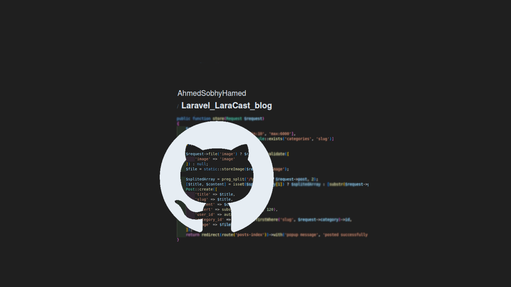
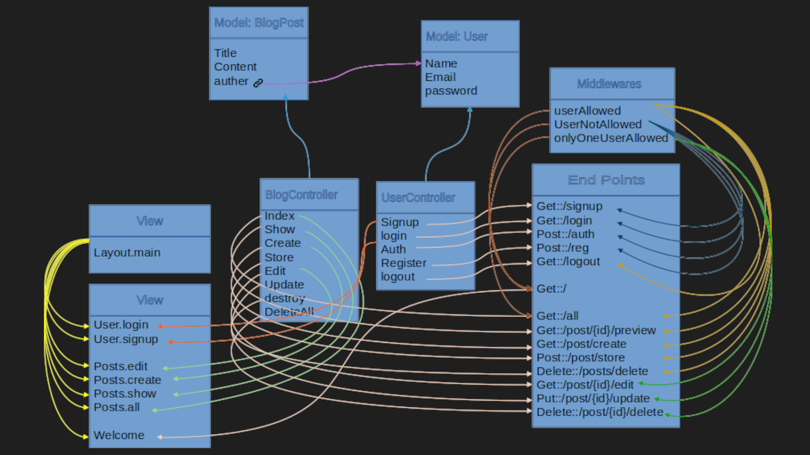

# Laravel_LaraCast_blog

A multi-contributor blog system that was created using Laravel and PHP.



## Table of Contents

-   [Introduction](#introduction)
-   [Features](#features)
-   [Installation](#installation)
-   [Usage](#usage)
-   [Technologies Used](#technologies-used)
-   [Project Structure](#project-structure)
-   [License](#license)
-   [Contact](#contact)

  <!-- intro -->

## Introduction

A multi-contributor blog system with features to add posts, add comments, update posts, delete posts, delete comments, and update comments.
<br>
You can register or log in to create your own posts or comment on other users' posts.
<be>
A search feature is also available for users to find specific posts.

  <!-- technologies was used with links if available -->

## Features

```diff
- Clean code.
- Using MVC architecture.
- Controllers and endpoints are created using resourceful conventions.
- Using Laravel Authentication system.
- Validating users data.
- Shows validating feedback messages.
- Using ORM Laravel eloquent models.
- Create CRUD system.
- Paginate the output.
- Caching rarely changed database-fetched data.
- Utilizing mutators in models.
- Utilizing accessors in models.
- Utilizing relationship functions in models.
- Changing the default route key to slug.
- Utilizing scopeFilter in models.
- Implementing the Blade component approach.
- Create middleware.
- Create Gates.
- Seeding with fake data for testing purposes.
- Integrating third-party services.
- Notification messages informing users about the outcome of their last request.
```

  <!-- get start and how to run with the prerequisites mintion -->

## Installation

1. install pre-requisies utilities

    - install php
      on Ubuntu, Debian, and Linux Mint:

        ```sh
        sudo apt-get install php8.1 php8.1-cli php8.1-common php8.1-curl php8.1-mysql
        ```

    - install mysql
      on Ubuntu, Debian, and Linux Mint:

        ```sh
        sudo apt-get install mysql-client-8.0 mysql-client-core-8.0 mysql-server-core-8.0
        ```

    - install composer
      on Ubuntu, Debian, and Linux Mint:

        ```sh
        sudo apt-get install composer
        ```

    - install npm
      on Ubuntu, Debian, and Linux Mint:

        ```sh
        sudo apt-get install nodejs npm
        ```

2. Clone the repository:

    ```sh
    git clone https://github.com/AhmedSobhyHamed/Laravel_LaraCast_blog.git
    ```

3. Navigate to the project directory:

    ```sh
    cd work_directory
    ```

4. Install dependencies:

    - laravel dependencies

        ```sh
        compose install
        ```

    - node dependencies

        ```sh
        npm install
        ```

5. Set up environment variables:

    ```sh
    cp .env.example .env
    ```

6. Link storage to public folder:

    ```sh
    php artisan storage:link
    ```

7. Create Database and User:

    - open mysql

        ```sh
        sudo mysql
        ```

    - create database

        ```sh
        CREATE DATABASE LaraCastBlog;
        ```

    - create user

        ```sh
        CREATE USER IF NOT EXISTS
        'larauser'@'localhost' IDENTIFIED WITH caching_sha2_password BY 'password'
        REQUIRE NONE
        WITH MAX_CONNECTIONS_PER_HOUR 1800 MAX_USER_CONNECTIONS 5
        PASSWORD EXPIRE NEVER FAILED_LOGIN_ATTEMPTS 5 PASSWORD REQUIRE CURRENT PASSWORD_LOCK_TIME 1;
        ```

    - grant privilages

        ```sh
        GRANT INSERT,UPDATE,DELETE,SELECT,CREATE,DROP,ALTER,REFERENCES ON `LaraCastBlog`.* TO 'larauser'@'localhost';
        FLUSH PRIVILEGES;
        ```

8. Migrate tables:

    ```sh
    php artisan migrate
    ```

    or Migrating with seed data (for testing environments only)

    ```sh
    php artisan migrate:fresh --seed
    ```

9. Adding fake data for testing purpose (optional):

    - open tinker

        ```sh
        php artisan tinker
        ```

    - faking data and use seed

        ```sh
        php artisan DB:seed
        ```

10. Integrating Mailchimp services(optional):

    - Sign up for an account on Mailchimp.
    - Create your audience list.
    - Retrieve your API key, audience list name, and key name, then add them to the .env file.
        ```bash
        MAILCHIMP_KEY_NAME = ""
        MAILCHIMP_API_KEY  = ""
        MAILCHIMP_SUBSCRIBERS_LIST = ""
        ```

11. Start the application:

    ```sh
    php artisan serve
    ```

    Then open the browser to the link typed in the terminal.

  <!-- usage or how to interact with this technologies like api end points and what they do -->

## Usage

<!-- **You can interact with the project via this link**
[web page on github](https://ahmedsobhyhamed.github.io/Laravel_EasyT_project2/).
<br> -->

**[see an example for user interaction.[video]](http://youtube.com)**

#### Interacting with endpoints in the browser:

1. Managing users and sessions.

    - Pages for registering an account or logging in with existing credentials

    ```diff
    http://localhost:8000/login
    http://localhost:8000/register/create
    ```

    - Displaying user profiles

    ```diff
    http://localhost:8000/user/show?user=<username>
    ```

    - Displaying user posts

    ```diff
    http://localhost:8000/authers/{auther}/posts
    ```

    - Logging out the user.
      **must use delete method**

    ```diff
    http://localhost:8000/logout
    ```

2. Resourceful posts links.

    - Displaying all posts

    ```diff
    http://localhost:8000/posts
    ```

    - Displaying the 'Creating a new post' page

    ```diff
    http://localhost:8000/posts/create
    ```

    - Displaying the 'Edit post' page

    ```diff
    http://localhost:8000/posts/edit?post=<post_slug>
    ```

    - Displaying specific posts

    ```diff
    http://localhost:8000/posts/{post}
    ```

    - Deleting a post
      **must use delete method**

    ```diff
    http://localhost:8000/posts/delete?post=<post_slug>
    ```

3. Category links.

    - Show all posts for a specific category

    ```diff
    http://localhost:8000/category/{category}
    ```

4. Mailchimp page.

    - View the Mailchimp page

    ```diff
    http://localhost:8000/mailchimp
    ```

## Technologies Used

-   languages:

    -   PHP.
    -   mysql.
    -   HTML 5.
    -   CSS.
    -   Javascript.

-   framworks and Libraries:

    -   Laravel.
    -   JQuery.
    -   Bootstrap.
    -   spatie/yaml-front-matter
    -   mailchimp/marketing

      <!-- about the project and a digram of how it work -->

## Project Structure



  <!-- licance -->

## License

This project is licensed under the MIT License - see the [LICENSE](/LICENSE) file for details

  <!-- contacts -->

## Contact

Created by [Ahmed Sobhy]:

-   email: [ahmed.s.abdulaal@gmail.com](mailto:ahmed.s.abdulaal@gmail.com)
-   linkedin: [Ahmed Sobhy](https://www.linkedin.com/in/ahmed-sobhy-b824b7201/)
    <br>
    feel free to contact me!
